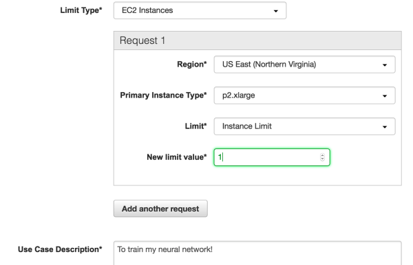
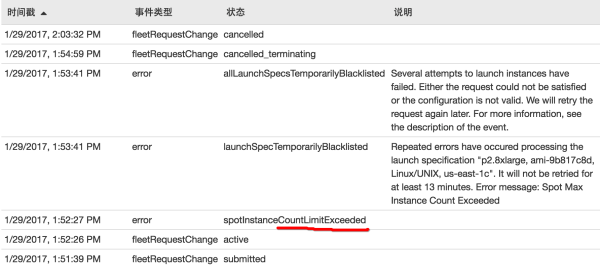
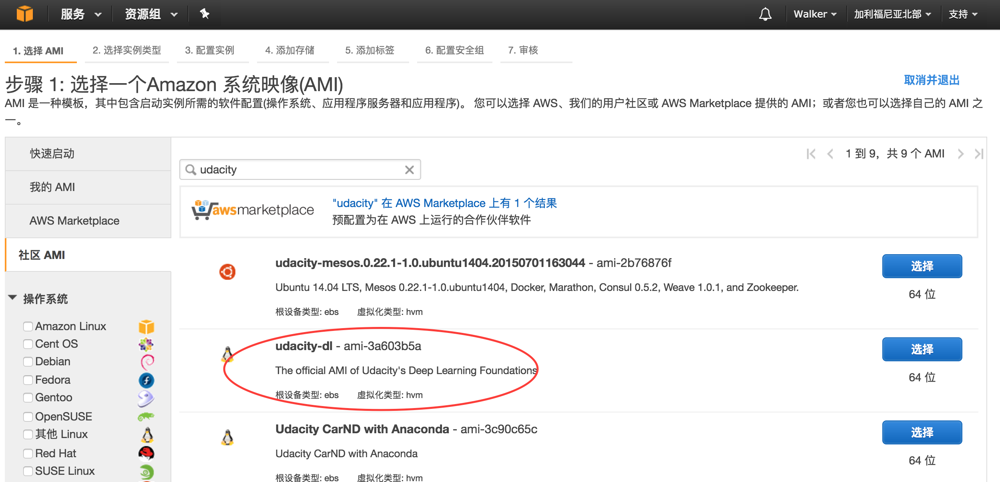

# 使用AWS GPU主机十倍加速完成图片分类项目	
最近在Udacity上学习深度学习，沉迷各种神经网络模型，例如CNN，RNN，GAN等等，一发不可自拔。第一次发觉自己学习的内容是离学术界和工业界这么得近，经常会实现2015年，2016年的论文，瞬间觉得自己其实美国一流高校PHD在读呢。

项目1 就是用numpy实现一个神经网络，实现正向传播和反向传播，对数学要求比较高，但还用不到tensorflow，但到了项目2需要完成图像分类，瞬间就用参考Lenet5搭了一个10多层的卷积神经网络。


代码倒也不难写，核心代码就钥匙构造一个卷积神经网络，把输入tensor（一张图片），输出一个10维的概率分布。

```
def conv_net(x, keep_prob):
    
    l1 = conv2d_maxpool(x_tensor = x, 
                    conv_num_outputs = 6, 
                    conv_ksize = (5,5),
                    conv_strides = (1,1), 
                    pool_ksize = (2,2), 
                    pool_strides = (2,2)
                       )
    
    l2 = conv2d_maxpool(x_tensor = l1, 
                    conv_num_outputs = 16, 
                    conv_ksize = (5,5),
                    conv_strides = (1,1), 
                    pool_ksize = (2,2), 
                    pool_strides = (2,2)
                       )

    l3 = flatten(l2)
    l4 = fully_conn(l3, 120)
    l4 = tf.nn.dropout(l4, keep_prob)

    l5 = fully_conn(l4, 84)
    l5 = tf.nn.dropout(l5, keep_prob)
    
    return output(l5, 10)
```
但是训练起来那叫一个吃力，每一次迭代都要近一分钟的时间，十分的缓慢。

```
Training...
Epoch  1: 
Training Loss:  1.65 Validation Accuracy: 40.88%
Time 41.9s

Epoch  2: 
Training Loss:  1.51 Validation Accuracy: 43.62%
Time 41.7s

Epoch  3: 
Training Loss:  1.46 Validation Accuracy: 45.86%
Time 40.5s

Epoch  4: 
Training Loss:  1.30 Validation Accuracy: 49.28%
Time 44.5s

Epoch  5: 
Training Loss:  1.23 Validation Accuracy: 50.62%
Time 44.0s

...
```

这真是没有GPU的穷学生的哀伤。令人愉快的是，这时候突然免费获得了Udacity发给每个学生的100刀aws优惠券，哇，好开心！瞬间跃跃欲试，要去用一个 [AWS EC2 P2 实例](https://aws.amazon.com/cn/ec2/instance-types/p2/)

p2.xlarge 是一种非常适合深度学习的云服务器，它配备了 12G 显存的 Tesla K80 显卡，4核 CPU，60G 内存，以及 500M 的网速。如果你还嫌不够，可以选择它的8倍和16倍的版本。

### 注册账号

首先我们需要注册一个 aws 账号，从刚才的地址可以注册，需要 visa 或 mastercard 信用卡。

注册好了以后，我们需要申请 p2.xlarge 的权限，因为默认限制0台。（注意，提供 p2 的地区并不多，我所知道的两个地区是北弗吉尼亚和俄勒冈。）

### 填写工单

[请求提高限制](https://console.aws.amazon.com/support/home#/case/create?issueType=service-limit-increase&limitType=service-code-ec2-instances)



不然就会出现可恶的 Instance Count Limit Exceeded 。



###开启实例
###选择 AMI
[EC2控制面板](https://console.aws.amazon.com/ec2/home)

首先点击启动实例，记得Udacity提供的深度学习专用AMI，因为预装了Anaconda, Python2/3, Tensorflow GPU, Keras, OpenCV, Jupyter Notebook，比较省折腾。



###选择一个实例类型

这里选 p2.xlarge 就好，开启以后一分钟和59分钟都算一个小时，所以开了以后可以放心大胆折腾一个小时，坏了也不用怕，删掉再开一个就好。注意：如果你选择的是 8x 或者 16x，你需要自己实现多 GPU 的代码，不然 Keras 只会使用一个 GPU 来训练。


后面三步直接下一步就好。

###配置安全组
按照如下配置，即接受任何位置的ssh访问，以及接受8888端口与任何ip的通讯。要使用ssh是因为我们需要ssh到机器上。要使用8888端口是因为jupyter noteboook的网页端是8888端口。


###连接
```
ssh linux@55.55.55.55
```
其中55.55.55.55改成你的aws实例的ip地址。
###开始写代码

你可以通过下面的命令开启一个支持远程连接的 jupyter notebook：


```
jupyter notebook
```
然后你用浏览器进入你的服务器 IP:8888 就可以连上服务器，点击右上角新建 notebook 并编写 python 代码了。

如果你想断开 ssh 连接以后还可以在后台运行 notebook，你可以加screen这个命令：

```
screen jupyter notebook --ip=0.0.0.0
```
这个 screen 命令同样适用于其他命令，例如起一个微信机器人之类的。

### 停止

当你不使用实例的时候，记得停止它。停止以后，不会计费。

事实上由于我又Udacity发给我的100美金优惠券。收费可以参照[这里](https://aws.amazon.com/cn/ebs/pricing/)，一个月 30G 的 SSD 收费是3美元，因此你可以自行权衡数据和价格。若是一个月以后还要用这些数据，而你愿意出3美元保持这些数据，避免一个月以后麻烦，那么你可以不必终止该实例。当你长期不打算使用该实例时，请务必终止该实例。

### 竞价实例

竞价实例是一种特殊的实例，它可以以超低的价格提供配置一样的实例，和普通实例的差别在于不可停止，因此当你想跑比较大的网络的时候（训练时间大于1小时），用竞价实例会非常划算。0.9美元每小时的 p2.xlarge 在竞价实例一个月的历史记录里很少超过0.3美元。即使超过了，我们也不会出高于0.9美元的价格。

上图是这两天的账单，我用了40小时，才花了5.33美元，平均一小时0.13美元，但是这并不代表之后还是保持这个价格。

我一般是这样开竞价实例的，为什么选请求并维护呢？因为你在实际使用的过程中一定不希望跑着跑着机子被停掉，因此我们采取的是请求并维护这种模式，如果价格上涨，我们补上就好了，最高肯定不会超过0.9美元的。

### 训练速度
**翻十倍的时间到了！！！**

训练一个迭代从之前的40秒变成了现在的4秒，再也没有低头玩手机的借口了。

```
Training...
Epoch  1: 
Training Loss:  1.69 Validation Accuracy: 40.88%
Time 4.5s

Epoch  2: 
Training Loss:  1.58 Validation Accuracy: 45.88%
Time 4.6s

Epoch  3: 
Training Loss:  1.48 Validation Accuracy: 48.14%
Time 4.6s

Epoch  4: 
Training Loss:  1.40 Validation Accuracy: 50.92%
Time 4.7s

Epoch  5: 
Training Loss:  1.32 Validation Accuracy: 51.12%
Time 4.6s
```

一行代码都没改，44秒变4秒，学校效率爆表有没有。免费的aws优惠码，还不快试试？