# Google I/O 核心信息：Mobile first to AI first

Google I/O 第一天上午的 keynote 刚刚结束，我觉得我至少听到了500次人工智能，300次机器学习 和 200次深度学习。 任何新的产品，说着说着就是，**感谢机器学习的核心，我们有了这个功能**。 如果只能带回去一个信息，那就是 Mobile first to AI first。

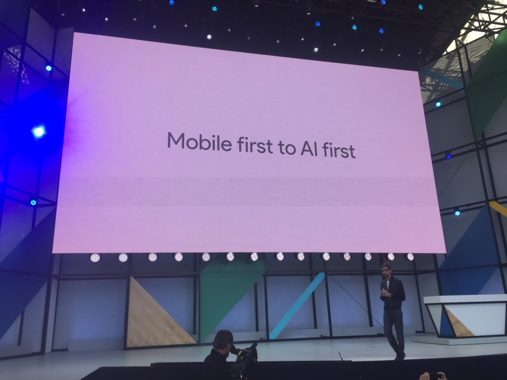

## Google Lens
首当其冲的就是Google Lens

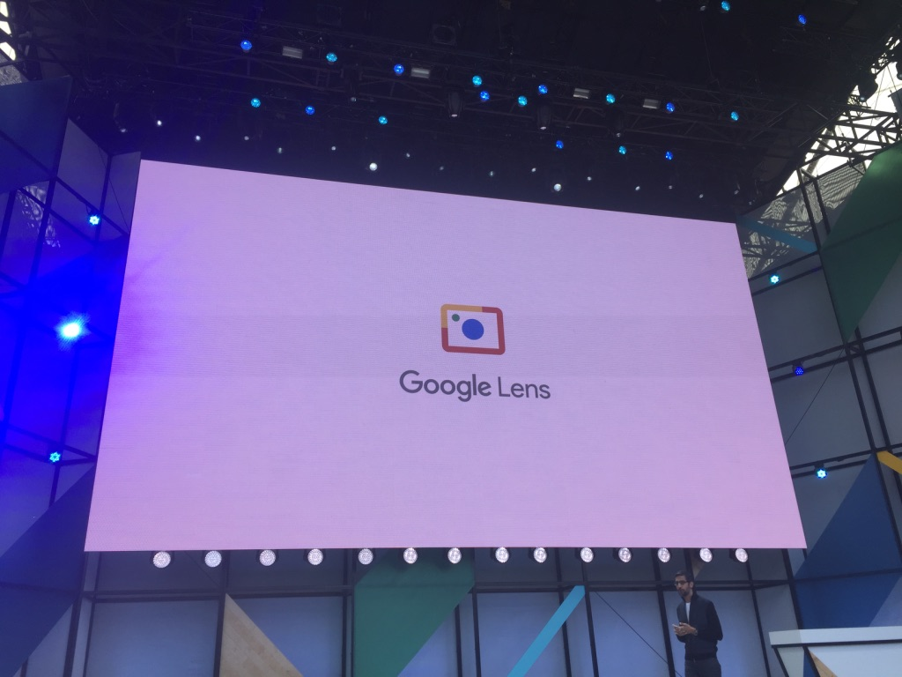

Google Lens可以理解你正在拍摄的场景或以前的照片，**并且给你相应的行为推荐**。 我个人觉得前半句没什么，给image打标题，已经不是什么新闻了。 基本已经被学术界解决掉了。给你对应的行为推荐，才是真正能解放劳动力／创造生产力的地方，而且会涉及到很多知识图谱的研究成果。举三个例子：

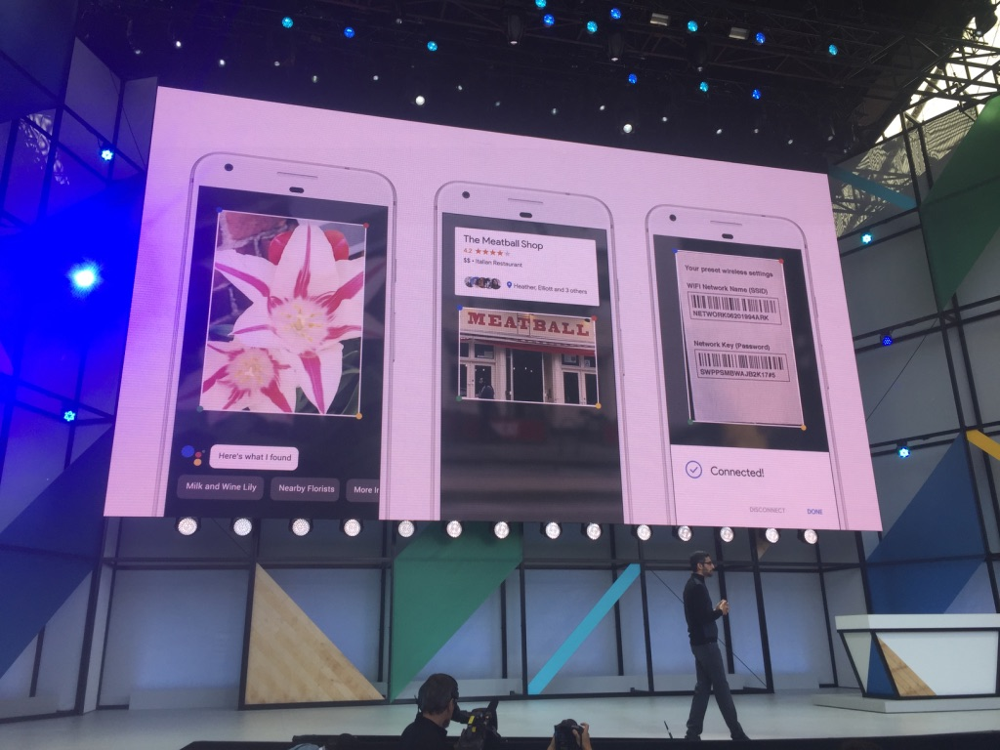

最左边的可以识别出花的名字，这个不怎么有趣。中间的可以识别饭店并且给出链接，这个其实就必须要结合饭店的名字和手机的位置，自动去完成搜索，最后给出这个饭店的链接。别觉得这个很简单，要去完成这每一个任务很容易，但是要去知道做正确的事情却很难。最右边的是扫描路由器背后的标签，然后自动连上网络。这个行为如果是在离线的情况完成，也非常的不容易！

## Tensor Processing Unit
接下来重点移到了Google自己的硬件 Tensor Processing Units (TPU) 上面。

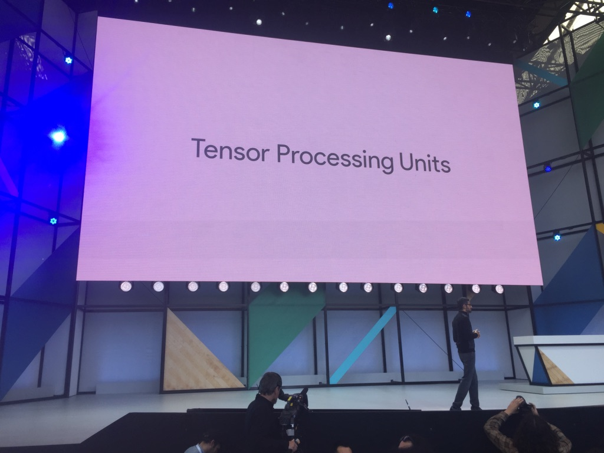

这完全就是叫板Nvidia的节奏，现在工业界学术界所有深度学习，机器学习的所有人，都在用Nvidia的GPU跑网络。 连Tensorflow也只支持 Nvidia 的 GPU。这本就不合理嘛，怎么可以把所有的深度学习都绑在一个闭源的东西上面呢。这下都明白了，Google在憋大招呢。Google要推出自己的计算单元，TPU 快到掉渣，而且将整个TPU阵列放到云端让所有人可以用到。

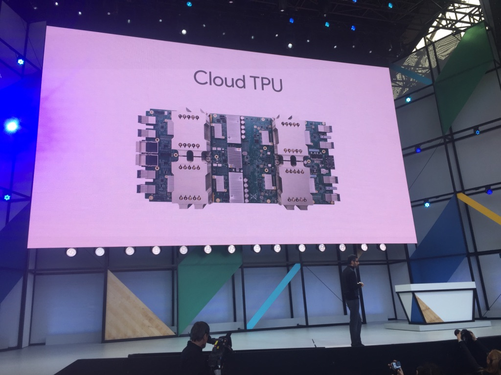
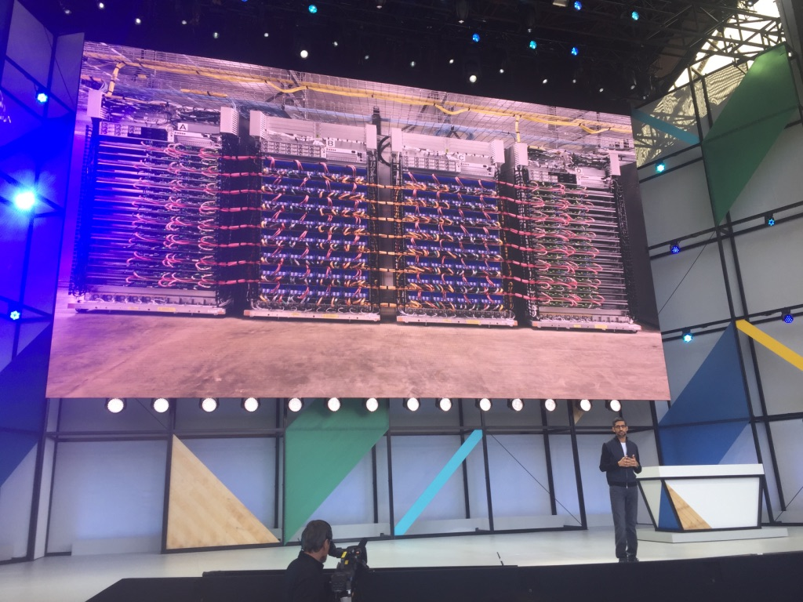
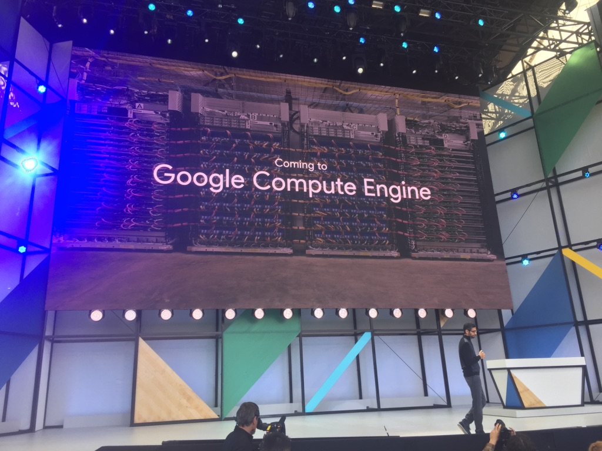

我突然记得google cloud platform 新用户有300刀credit，啊呀呀，激动不已！

## Google.ai
接着就说到了Google.ai
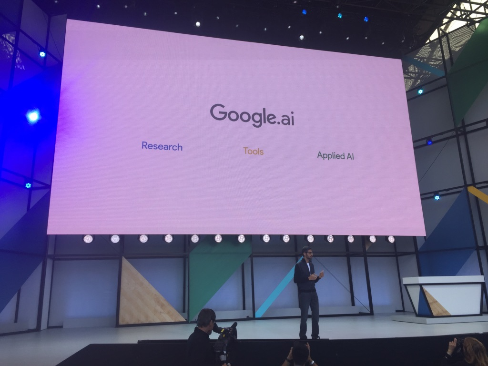

Google.AI 会在科研，工具，应用三个方面都有所建树。
首先工具方面会有AutoML用神经网络来训练厉害的神经网络，看来幸苦调参数的日子结束了。

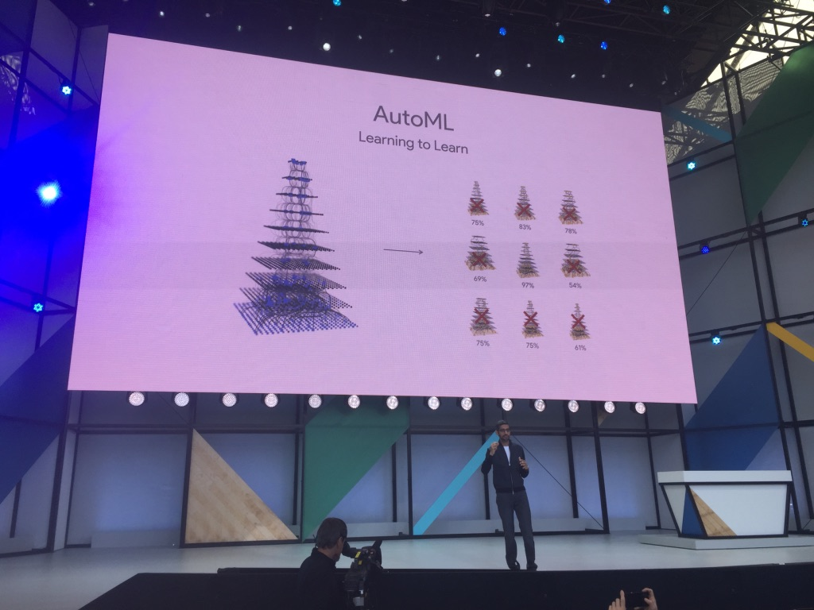

科研方面病理学的研究, DNA序列的研究和分子的合成不是很懂，反正很厉害就对了。总之就是要用深度学习来帮助诊断肿瘤的位置,DNA序列的发现和分子的合成。
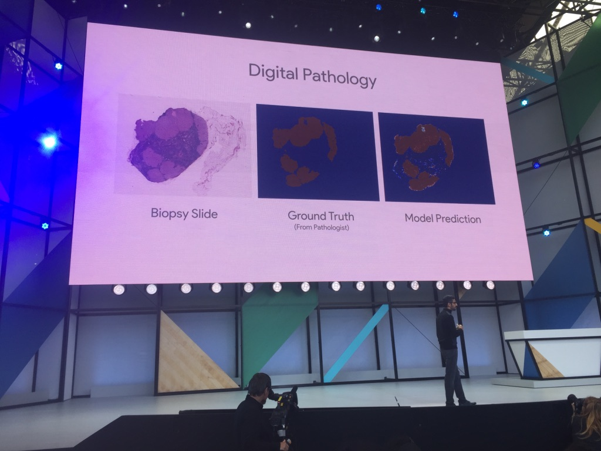

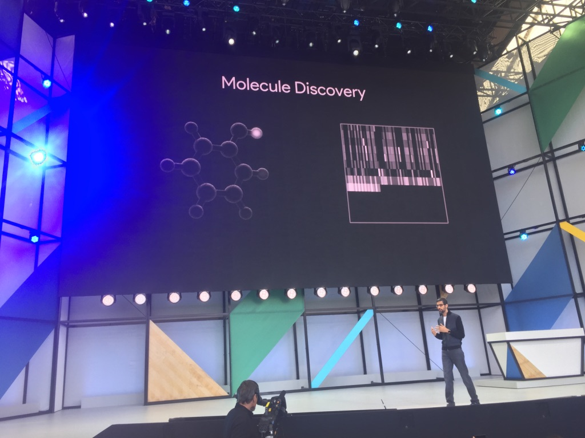

应用方面的话，首先当然是大家很数学的**灵魂画手**的福音，以前从来没人知道我在画什么，现在Google知道了。内牛满面。我觉得毕加索的时代又要到来了。
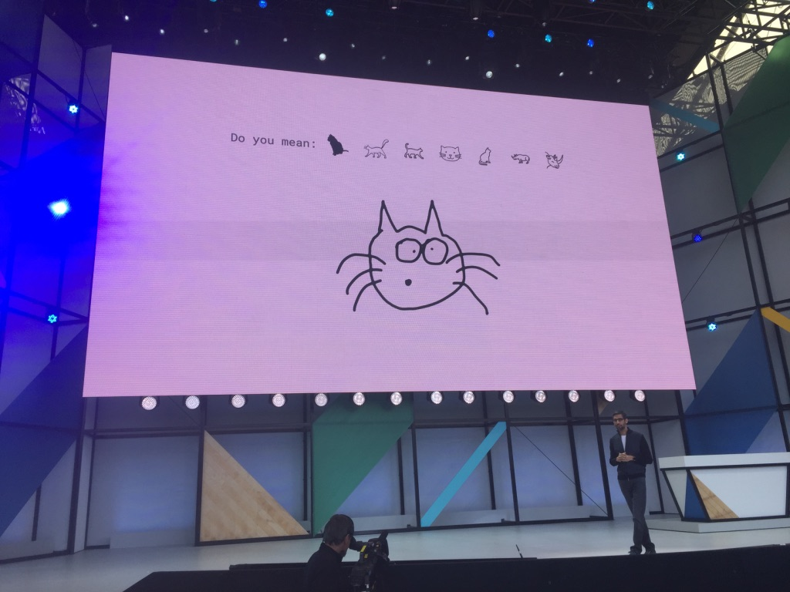

总之就像「盗梦空间」里面说的。

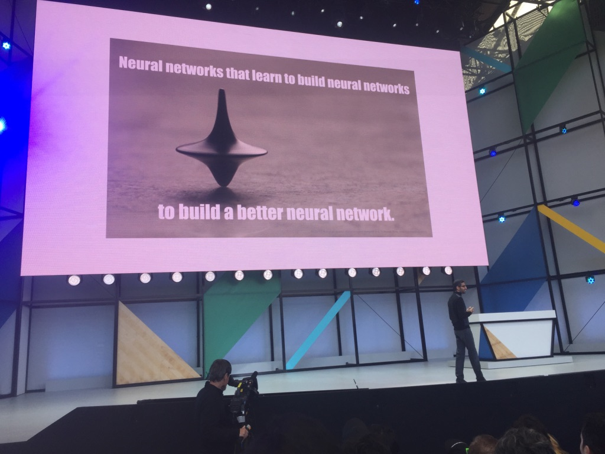

# We need to go deeper