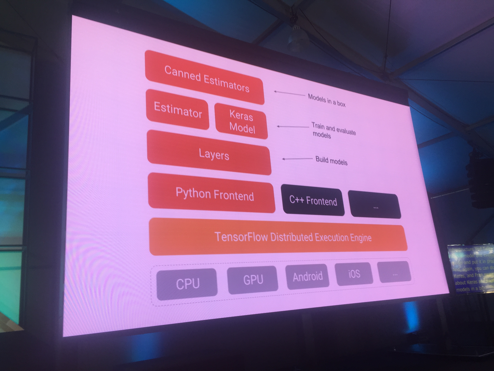
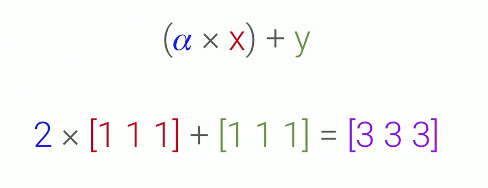
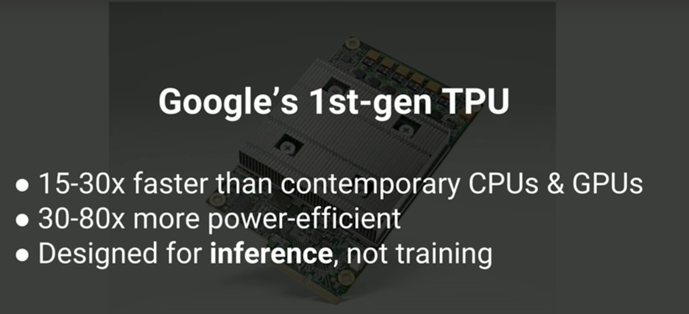
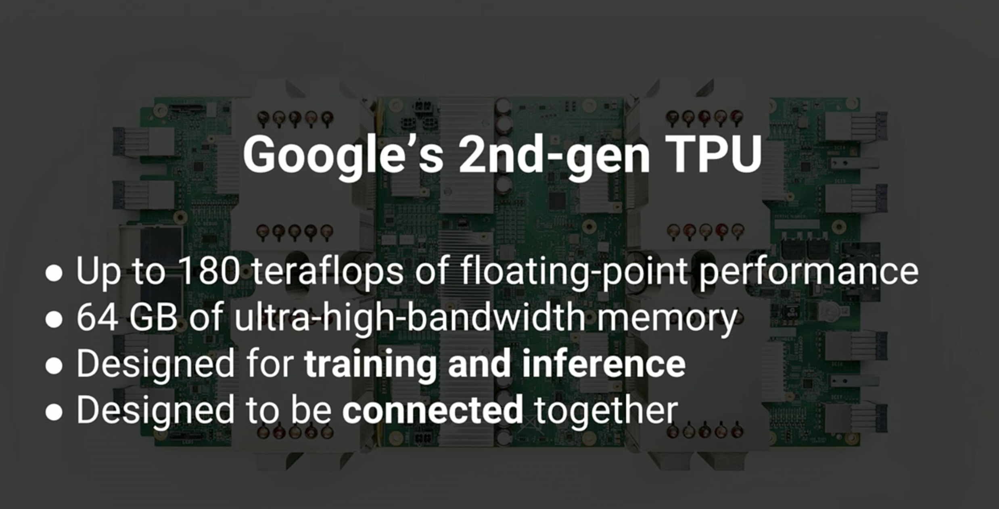
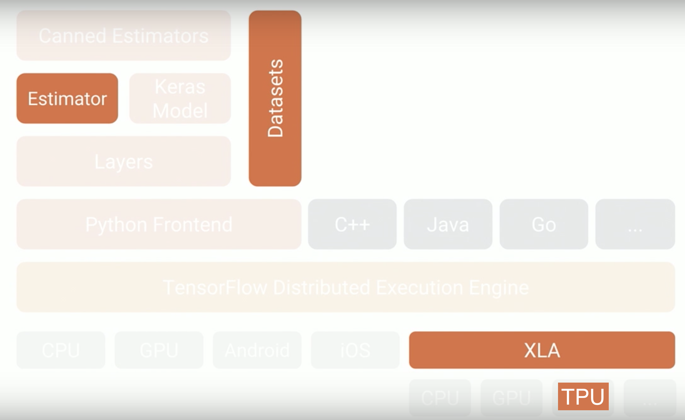
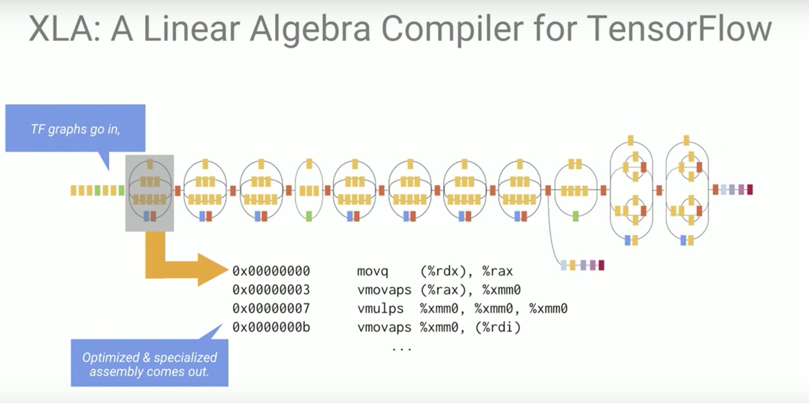
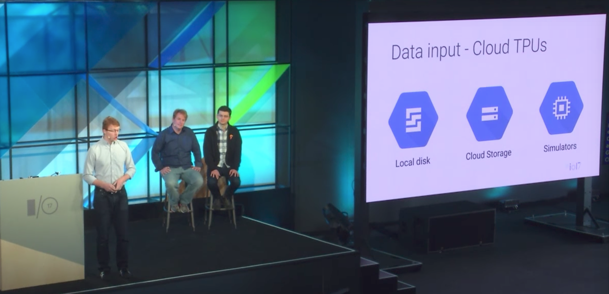

#Cloud TPU，XLA，Tensorflow 1.2 从下到上全面优化，I/O大会上Tensorflow的大新闻都在这里了！

这次大会的主题大家都知道了吧？**Mobile first ro AI first**


各种各样的产品新功能都搭上了机器学习的影子，所有这些酷炫功能的源头，都来自于Tensorflow的代码。所有这些代码，都来自于计算单元TPU，Google深度学习的大新闻可不能漏了。这才是真正决定Google的未来，还有我们自己未来的新闻呢！

### Tensorflow 是什么？
想来用最简单的话科普下Tensorflow是什么。Tensorflow是一个深度学习框架，也就是进行深度学习训练的工具，可以在分布式系统上执行的引擎。



这个图内容太多。但对大多数人来说，关键点就是 Python Fronted, Layers 和上层的所有东西。给大家一点小代码展示一个最简单的模型。



```
>>> import tensorflow as tf
>>> sess = tf.Session()
>>> x = tf.ones(3)
>>> y = tf.ones(3)
>>> a = tf.constant(2.0)
>>> res = (a*x) + y
>>> print(sess.run(res))
[ 3.  3.  3.]

``` 

我们就是在一个session中跑了一个叫做res的“图”，最后得到结果 `[3,3,3]`

下面进入正题

### TPU 和 Cloud TPU
Google在15年就开发出了自己的计算芯片，运算速度比市面上最快的GPU快10倍。但也有局限性，因为只能用来做推理不能做训练（机器学习的模型都是先训练，后推理，好难想象不能训练只能推理的硬件芯片）


16年开发出了第二代TPU，180 teraflop 的性能。180T 是什么概念呢？对比一下就知道了。 Nvidia 的 GeForce GTX 980，最新的笔记本目前大概都用这个显卡，是4358 gigaflop，也就是4.3 Teraflop. TPU 差不多快了40倍！！！ 以前一小时的训练，现在只要1分30秒了，想想就好激动。 


这还没有结束，它还设计为可连接的元件，也就是可扩展。Google会把TPU组成一个个阵列。并且放到云端供开发者使用。


开发者怎么用呢？只要把上面的代码修改两句话

```
>>> import tensorflow as tf
>>> sess = tf.Session('grpc://tpu.machine.ip:port')
>>> with tf.device('device:TPU:0'):
... 	x = tf.ones(3)
... 	y = tf.ones(3)
... 	a = tf.constant(2.0)
... 	res = (a*x) + y
>>> print(sess.run(res))
[ 3.  3.  3.]
```

我们就用上了TPU了。我已经激动不已要去试试看了。

### Tensorflow 1.2

硬件说完，下面来说说软件。对比上面那个tensorflow的图，Tensorflow 1.2 新添了下面几个方块。从底层硬件TPU，到编译器XLA，到上层封装好的Estimator，再到整个对于数据的支持。如此全面覆盖，真的堪称良心。



### XLA
XLA全称是 Accelerator for Linear Algebra



也就是专门针对 TPU 优化的编译器。将高级语言（例如python）中定义的 tensorflow 图编一个机器语言中的矩阵乘法。对传统的计算机视觉领域比较熟悉的同学都知道，凡事能用矩阵运算的千万不能用循环，效率千差万别。GPU之所以比CPU快也是因为他对于复杂的线性代数运算有更好的优化。现在有专门针对TPU优化的编译器，可谓从下到上都磨了一遍刀，效率杠杠的。

### Estimator
说完了硬件的优化，编译器的优化最后就到了高级语言的优化，是时候给程序员写程序加加速了！现在Tensorflow写起来也更容易了。我们可以把写好的模型封装起来直接用, 如果你接触过sklearn的话，就立刻能发现它的方便之处了。

```
tf.contrib.learn.LinearClassifier 
tf.contrib.learn.LinearRegressor 
tf.contrib.learn.DNNClassifier
tf.contrib.learn.DNNRegressor
```

LinearClassifier, LinearRegressor 这些名字熟悉不熟悉？以后就可以直接用了！DNN是什么，DNN就是deep neural network，最普通的神经网络，无论是用来分类还是回归，也可以直接用了！

### Datasets
巧妇难为无米之炊，就算Tensorflow从上到下全部优化了一遍，没有数据还是白搭。



Cloud TPU支持本地，云存储甚至在云端进行模拟（例如要做增强学习）, 不过这存储估计也是要花不少钱，aws 现在在这一块领先很多，google也要加油啊！

### 说太多了，总结一下？
一个计算机就是有硬件，编译器和软件组成。Tensorflow 这个生态分别更新了

- 硬件（TPU）
- 编译器（XLA）
- 软件（Estimator）

可以说从上到下全部焕然一新，这还不包括他们更新的API，他们对于数据的支持，他们开放的The TensorFlow Research Cloud项目，所有的这些都会对工业界学术界有莫大的益处！10086个赞！